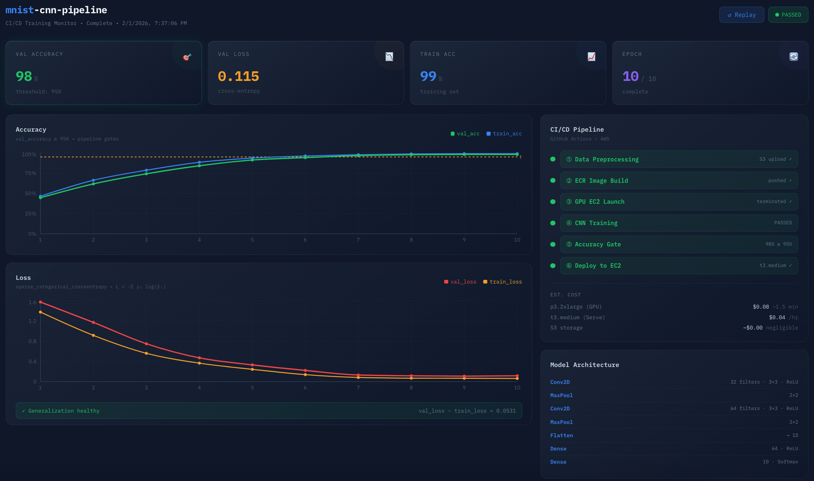

    <nav>
        <a href="#About Me" style="margin-right: 15px; text-decoration: none;">About Me</a>
        <a href="#Work Experiences" style="margin-right: 15px; text-decoration: none;">Work Experiences</a>
        <a href="#Projects" style="margin-right: 15px; text-decoration: none;">Projects</a>
        <a href="#Contact" style="text-decoration: none;">Contact</a>
    </nav>
    

        
    

    

        
    

    

        
Hi there! I’m Minji Lee, a Ph.D. candidate in Technology at Purdue University, specializing in Computer Vision and UAV-based Semantic Segmentation. My research focuses on developing machine learning pipelines for high-resolution aerial imagery, with a particular emphasis on ecological monitoring and object-level segmentation. I completed my PhD program in August 2025.

    

## About Me

I am originally from Seoul, South Korea, and I also had the opportunity to live in Japan for a time. In 2016, during my senior year as an undergraduate student, I had the privilege of visiting Purdue University as part of a visiting scholar program. That experience left a lasting impression on me, and I was excited to return to Purdue after being offered a Research Assistantship and admission to the graduate program.

For my master’s thesis, I designed an intelligent zipper robot that integrated a machine learning algorithm to determine the optimal operational threshold based on sensor data collected from individuals with physical disabilities. The system leveraged real-time input to adapt its behavior, enhancing both performance and usability for users with varying levels of physical ability. This research combined robotics, human-centered design, and algorithmic decision-making to support more inclusive assistive technologies.

## Work Experiences
I’ve previously interned at LG Innotek as an AI researcher within the AI/Big Data Solutions team. I also completed research internships at Argonne National Laboratory in both 2021 and 2022, contributing to projects in robotics and the Mathematics and Computer Science (MCS) division.

### [LG Innotek](https://github.com/minjilee-purdue/minjilee-purdue.github.io/blob/main/internships/LGInnotek/REAME.md)
**Deep Learning Pipeline - Docker + AWS + CI/CD**

<table style="width: 100%; table-layout: fixed;">
  <tr>
    <td style="width: 40%; height: 300px; vertical-align: middle;">
      
    </td>
    <td style="width: 60%; padding-left: 20px; vertical-align: middle;">
        A fully containerized ML pipeline that trains a CNN on MNIST and serves predictions via a REST API. Each stage (data, training, serving) runs in its own Docker container. Training runs on a GPU EC2 instance that terminates after completion. Serving runs on a long-lived CPU EC2 instance. All artifacts flow through S3.
        + Defect position heatmap analysis was performed on anonymized optical manufacturing data from LG Innotek. The labeled dataset had masked metadata and was used for exploratory quality control analysis.
    </td>
  </tr>
</table>

### [Argonne National Laboratory](https://github.com/minjilee-purdue/minjilee-purdue.github.io/blob/main/internships/LGInnotek/REAME.md)
**Deep Learning Pipeline - Docker + AWS + CI/CD**

<table style="width: 100%; table-layout: fixed;">
  <tr>
    <td style="width: 40%; height: 300px; vertical-align: middle;">
      
    </td>
    <td style="width: 60%; padding-left: 20px; vertical-align: middle;">
        A fully containerized ML pipeline that trains a CNN on MNIST and serves predictions via a REST API. Each stage (data, training, serving) runs in its own Docker container. Training runs on a GPU EC2 instance that terminates after completion. Serving runs on a long-lived CPU EC2 instance. All artifacts flow through S3.
        + Defect position heatmap analysis was performed on anonymized optical manufacturing data from LG Innotek. The labeled dataset had masked metadata and was used for exploratory quality control analysis.
    </td>
  </tr>
</table>

### [Argonne National Laboratory](https://sagecontinuum.org/)
**Sensor Visualization**

<table style="width: 100%; table-layout: fixed;">
  <tr>
    <td style="width: 40%; height: 300px; vertical-align: middle;">
      
    </td>
    <td style="width: 60%; padding-left: 20px; vertical-align: middle;">
        Integrated multimodal environmental sensor streams such as wildfire detection, acoustic monitoring, weather signals by aligning timestamps and standardizing outputs into unified JSON schemas on IBM edge nodes.
    </td>
  </tr>
</table>

## Projects

My research centers on building an end-to-end machine learning pipeline for UAV-based semantic segmentation, particularly for identifying Eastern Red Cedar trees in high-resolution aerial imagery. This pipeline integrates raw data collection, preprocessing, annotation, model development, evaluation, and deployment—tailored for ecological applications where precision and scalability are critical.

### [Data Acquisition](https://docs.google.com/document/d/e/2PACX-1vQEyPyyOf1dWuTM_iPO6zhZ1ob17SIY77qRhnsbDk_w7CzHv8Sy-6Kz1Dm2f6qiSnSVC3Xj9CNO_UND/pub)
**Multimodal Semantic Segmentation of Eastern Red Cedar Trees: Integrating Visual Masks and Natural Language Prompts**

key words: Instance Segmentation, Ground Sampling Distance, Multimodal

<table style="width: 100%; table-layout: fixed;">
  <tr>
    <td style="width: 40%; height: 300px; vertical-align: top;">
      
    </td>
    <td style="width: 60%; padding-left: 20px; vertical-align: top;">
        This study proposes a multimodal approach transforming instance segmentation masks into spatially grounded natural language prompts. By extracting segmented masks as a ground truth and estimating object dimensions, the system categorizes Eastern Red Cedar specimens based on their varying sizes and positions them within a 3×3 spatial grid. These attributes are subsequently translated into interpretive summaries which can suggest early-stage spread that can be addressed through immediate intervention as Agent AI. The descriptions generated support ecological decision-making by identifying removal complexity, prioritizing intervention zones, and estimating operational costs, facilitating resource allocation planning, as larger specimens require mechanical or fire-based removal strategies, while smaller individuals may be managed through manual intervention.
    </td>
  </tr>
</table>

---

### [Model Training](proj/DA/README.md)
**Exploring the Boundary Between Human-Defined Machine Learning and Data-Driven Deep Learning**

key words: Training Method, Feature Extraction

<table style="width: 100%; table-layout: fixed;">
  <tr>
    <td style="width: 40%; height: 300px; vertical-align: top;">
      
    </td>
    <td style="width: 60%; padding-left: 20px; vertical-align: top;">
      Rule-based ML techniques often require domain expertise and are effective when feature boundaries are well understood. In contrast, DL models excel in complex, high-dimensional environments by automatically extracting relevant features, albeit at the cost of transparency and increased computational demands. Through empirical experiments, we demonstrate how each method performs under different constraints and offer insights into when one approach may be favored over the other. The findings contribute to guiding model selection strategies in data-driven research and real-world applications.
    </td>
  </tr>
</table>

---

### [Model Evaluation](proj/DA/README.md)
**CedarSAM: Fine-Tuning Segment Anything Model for Semantic Segmentation of Eastern Red Cedar Vegetation from UAV Imagery**

key words: Mask-Decoder Tuning, Vision Transformer, Semantic Segmentation

<table style="width: 100%; table-layout: fixed;">
  <tr>
    <td style="width: 40%; height: 300px; vertical-align: top;">
      
    </td>
    <td style="width: 60%; padding-left: 20px; vertical-align: top;">
      Although the Segment Anything Model (SAM) has demonstrated remarkable generalization ability in zero-shot segmentation tasks, its performance on specialized or domain-specific imagery, such as aerial vegetation images, may fall short of the precision required for real-world applications. This study investigates the effectiveness of fine-tuning CedarSAM on a small and labeled dataset of aerial tree images to enhance segmentation performance for a specific tree species. Despite the limited dataset size, the results show that the CedarSAM model achieves notable improvements in segmentation accuracy across multiple metrics, including Dice score, IoU, Precision, Recall, and Inference time. These findings highlight the potential of domain adaptation with minimal data, enabling practitioners to deploy SAM effectively in niche applications without the need for large-scale datasets.
    </td>
  </tr>
</table>

---

### [Gen AI Model](proj/DA/README.md)
**Assessing Generative AI for Natural Object Segmentation: Eastern Red Cedar as an Evergreen Benchmark**

key words: Diffusion Model, Generative AI, Vision Transformer

<table style="width: 100%; table-layout: fixed;">
  <tr>
    <td style="width: 40%; height: 300px; vertical-align: top;">
      
    </td>
    <td style="width: 60%; padding-left: 20px; vertical-align: top;">
      The Eastern Red Cedar, an evergreen species, maintains its green foliage throughout the year, regardless of seasonal changes. This characteristic provides a consistent visual signature in UAV-captured aerial imagery, which significantly simplifies the process of creating segmentation mask annotations. In this study, we investigate the feasibility and effectiveness of using diffusion models to automate the annotation process for ERC trees. By leveraging the persistent green hue of ERCs across various temporal conditions, we aim to reduce manual labeling efforts while maintaining high-quality segmentation results. We evaluate the performance of the diffusion-based approach in generating accurate instance-level masks, considering both spatial consistency and ecological interpretability.
    </td>
  </tr>
</table>

---

### [Lec: Positional-Encoding](https://github.com/minjilee-purdue/minjilee-purdue.github.io/tree/main/lecture/transformer/positional-encoding/)
**Positional Encoding Visualization: How sine/cosine functions transform scalar positions into high-dimensional vectors**

key words: Transformer, Positional Encoding, Trigonometric Identities

<table style="width: 100%; table-layout: fixed;">
  <tr>
    <td style="width: 40%; height: 300px; vertical-align: top;">
      
    </td>
    <td style="width: 60%; padding-left: 20px; vertical-align: top;">
        An interactive visualization demonstrating how sine and cosine functions transform scalar position values into high-dimensional vectors in Transformer models. This project illustrates the mathematical process behind positional encoding in Transformer architectures: PE(pos, 2i) = sin(pos / 10000^(2i/d_model)) PE(pos, 2i+1) = cos(pos / 10000^(2i/d_model)).
    </td>
  </tr>
</table>

---

### SAM Demo with HuggingFace/Gradio

    
    
    

### Recent Projects

#### Fine-Tuning Segment Anything Model (SAM) for Ecological Image Segmentation: Detecting Eastern Red Cedar Trees from UAV Imagery
I'm excited to share my recent research on improving the Segment Anything Model (SAM) for domain-specific segmentation in vegetation-rich environments. While SAM, trained on the general-purpose SA-1B dataset, demonstrates strong zero-shot capabilities, its performance often falls short in complex ecological scenes.

To address this, I developed CedarSAM, a fine-tuned variant of SAM tailored to identify and segment Eastern Red Cedar (ERC) trees using high-resolution UAV imagery (5472 × 3648). The project focused on optimizing SAM with a small, custom-labeled dataset, aiming to enhance its segmentation accuracy for a single object class.

#### Dataset & Annotation Strategy
I manually annotated 106 aerial images and video frames (20 FPS), each containing ~4 ERC trees. Unlike typical object datasets, four annotation types were generated for each image:

- Bounding Boxes

- Object Masks

- Instance Masks

- Edge Annotations

These annotations supported diverse prompting strategies for SAM and significantly improved learning context.

  

#### Model Optimization
Selective Fine-Tuning: Only the mask decoder was updated while keeping encoders frozen to reduce overfitting and training time.

- Loss Function: Combined Focal Loss (for class imbalance) with Dice Loss (for spatial accuracy).

- Training Framework: Implemented in PyTorch, trained over 40 epochs, with the best performance recorded at Epoch 40.

#### Results & Insights
Compared to the original SAM, CedarSAM achieved:

- +2.6% Dice Score

- +4.6% IoU

- 10% Reduction in Inference Time

Visualizations clearly demonstrated more accurate segmentation and reduced False Positives (FP) and False Negatives (FN), using confusion matrix overlays (Green = TP, Blue = FP, Red = FN).

#### Best_Dice Examples

#### Best_Loss Examples

## Contact

If you have any questions, feel free to contact me at [lee3450@purdue.edu](mailto:lee3450@purdue.edu) or connect on [Minji Lee LinkedIn](https://www.linkedin.com/in/minji-lee-purdue/).

